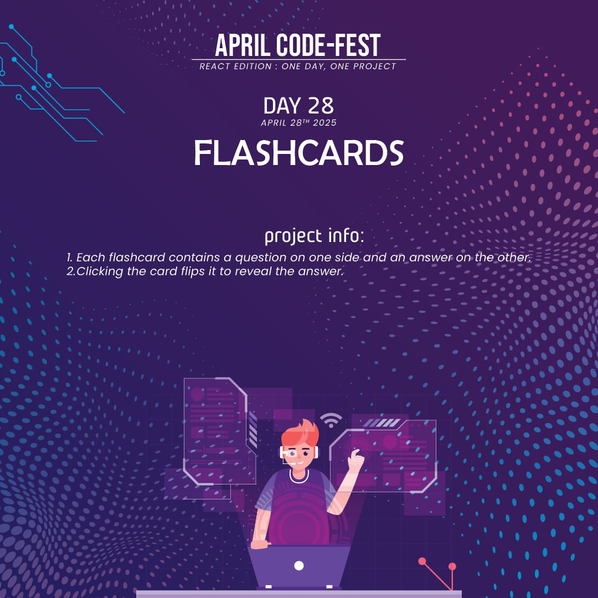
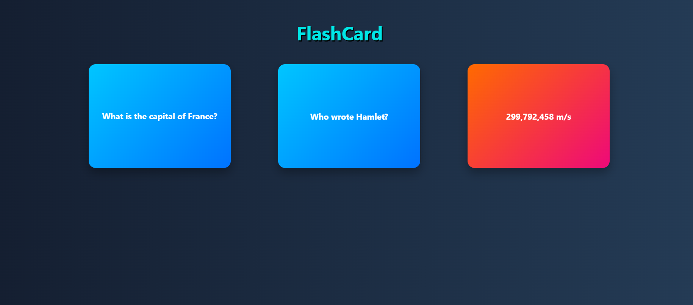

# 🎴 React Flashcard App

A fun and interactive flashcard app built with React where users can click on cards to flip and reveal the answers. Perfect for learning and practicing with a variety of topics. 🌟

---

## 🎯 Features
- 🎴 Clickable flashcards to reveal the answers
- 🚀 Smooth flip animation for cards
- 🧠 Great for learning and testing knowledge on various subjects
- 🖼️ Custom styling with modern and clean UI

---

## 🛠️ Technologies Used
- ⚛️ **React** (`useState` Hook for managing card flip state)
- 💻 **JavaScript** (Modern ES6+ syntax)
- 🎨 **CSS** (Custom styles for card layout and flip effect)
- 📄 **HTML** (Component rendering structure via JSX)

---
## 🚀 Live Demo

1. **Clone the repository:**
   git clone https://github.com/Eshhaa11/flashcards

2. Navigate to the project directory:    
   cd flashcards

3. Install dependencies:
   npm install

4. Start the development server:
   npm start

5. Open your browser and visit:
   http://localhost:3000

---

## 🎨 Screenshots

---

## 🤝 Contributing
Excited to improve this project? Fork the repository, create a feature branch, and open a pull request. Every contribution helps make it better! 🚀✨

Happy coding!
